> **Affected users:** Updating firmware does not repair a seed that affected firmware already generated. Read the [official COLDCARD advisory][2] and replace the affected seed before you use the wallet again. This post explains the incident. It is not a wallet-recovery guide.

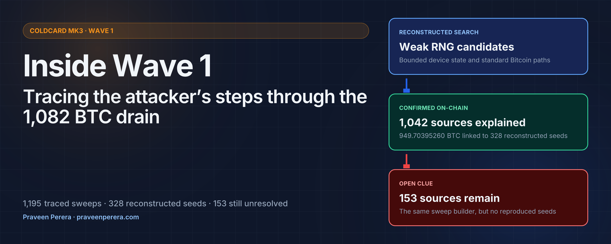

## Summary and key findings

Between 9:10 and 9:51 PM EDT on July 29 (01:10–01:51 UTC on July 30), an attacker swept **1,082.65318922 BTC** from **1,195 traceable Bitcoin addresses**. [Galaxy Research reported][1] the theft on July 31. I use **Wave 1** for this first sweep group.

- **The affected seed path did not reach the hardware RNG.** A build guard accepted a disabled hardware RNG, so normal seed generation used MicroPython's non-cryptographic Yasmarang fallback. On a cold-start Mk3, that path had a small, structured state space that could be enumerated.
- **I reconstructed 328 wallet seeds behind 1,042 of the 1,195 source addresses.** Those addresses contained **949.70395260 BTC**, or **87.72%** of Wave 1's value. Several stolen addresses derive from the same seeds, which confirms seed-level compromise rather than unrelated private-key leaks.
- **The blockchain shows one operation split into value-sorted jobs.** The 1,195 sweeps form three source branches and four broadcast queues. All use the same transaction template. The recovered seeds also divide into distinct scan-session ranges by destination branch.
- **The sweep system treated addresses as separate records, not wallets as the unit of work.** Its 500-address cap, newest-first input order, and failure to process more than 200 UTXO records are consistent with an address API feeding a separate transaction builder. BlockCypher is the closest technical match I found, but the provider attribution remains an inference.
- **The final 153 source addresses, containing 132.94923662 BTC, remain unexplained.** No researcher I have spoken with has reproduced a seed for any of them. They use the same transaction builder as the recovered set, so the missing difference appears to be earlier in the attacker's process. Public reconstruction attempts may be missing an input or a candidate-generation method.

The confirmed evidence establishes the weak firmware path, the reconstructed seeds, and the transaction structure. The attacker's tools, data sources, and identity remain inferred or open. [The final findings table](#what-is-confirmed-inferred-and-still-open) separates these categories.

I'm Praveen Perera, the developer of [Cove][11], an open-source Bitcoin wallet for iOS and Android funded by [OpenSats][17]. You can find me [on X as @PraveenPerera][12]. This article explains how I reconstructed Wave 1 from the firmware defect and the blockchain evidence.

## Table of Contents

- [Summary and key findings](#summary-and-key-findings)
- [Terms used in this reconstruction](#terms-used-in-this-reconstruction)
- [What this reconstruction assumes](#what-this-reconstruction-assumes)
- [The hardware RNG was never reached](#the-hardware-rng-was-never-reached)
- [Tracing the weak RNG path](#tracing-the-weak-rng-path)
- [What the recovered findings say about UID state](#what-the-recovered-findings-say-about-uid-state)
- [Other uses of the weak random stream](#other-uses-of-the-weak-random-stream)
- [Galaxy's Wave 1 baseline](#galaxys-wave-1-baseline)
- [Reconstructing the three branches](#reconstructing-the-three-branches)
- [One transaction builder across the wave](#one-transaction-builder-across-the-wave)
- [First-seen times show how the sweep ran](#first-seen-times-show-how-the-sweep-ran)
- [From reconstructed seeds to stolen addresses](#from-reconstructed-seeds-to-stolen-addresses)
- [What the reconstructed RNG paths suggest](#what-the-reconstructed-rng-paths-suggest)
- [The attacker's address pipeline](#the-attackers-address-pipeline)
- [Why I suspect a paid API and an Ethereum-style workflow](#why-i-suspect-a-paid-api-and-an-ethereum-style-workflow)
- [The last 153 addresses](#the-last-153-addresses)
- [What is confirmed, inferred, and still open](#what-is-confirmed-inferred-and-still-open)
- [How I got involved](#how-i-got-involved)

## Terms used in this reconstruction

- **Wave 1** is the first sweep group on July 29/30.
- **Source address** is the Bitcoin address whose unspent outputs were taken in one sweep transaction.
- **Input** is one previously unspent output consumed by that transaction. One source address can have many inputs.
- **Seed** is the root secret from which a wallet derives keys and addresses.
- **Branch** is one of the three source groups in this reconstruction.
- **Original 500** is the largest branch: 500 victim sweeps on Galaxy's published collector path.
- **Holding 2** is 491 victim sweeps after one consolidation step.
- **Holding 3** is 204 victim sweeps after two consolidation steps.
- **Scan-session count** is a position in the tested firmware flow before the seed request. It is not a literal count of button presses.
- **Pad** is `UID[0] XOR SysTick`, the 32-bit Yasmarang state word on the weak path.
- **Observed pad range** is the recovered pad high words from 15 through 75. The first search used 90 as an upper bound before that range was known.
- **Candidate stream** is the sequence of weak seeds produced by enumerating reconstructed RNG states.
- **Historical snapshot** is the fixed funded-address index from block 960182, immediately before Wave 1.

One wallet seed can derive several source addresses. Each source address was swept in a separate transaction.

## What this reconstruction assumes

I began the Wave 1 reconstruction described here on August 6, one week after the drain. The search used a historical snapshot from immediately before Wave 1. When I began this research, the Wave 1 source outputs had been spent one week earlier.

Later conclusions depend on these limits:

1. **Transaction set.** I use 1,195 verified victim sweeps traced from Galaxy's four destination addresses.
2. **Historical index.** I matched candidates against the historical snapshot at block 960182. A finding means the address was funded before the theft. I did not use live balances to select candidates.
3. **Main seed model.** The recovered Wave 1 set is explained with the zero-RTC keypad path and no added dice. Other event traces were tested; they mainly reproduced seeds the main model already found.
4. **Search shape.** Claims about how the attacker searched assume that the 328 reconstructed seeds show the shape of the full Wave 1 search. If the final 153 used a different seed-generation path, those claims can change.
5. **Pad model.** The pad is one XOR word, not independent UID and SysTick secrets concatenated together. The 15–75 high-word range is observed from recovered wallets. It is not a direct physical UID measurement.
6. **Confirmed versus inferred.** On-chain transaction shape, reproduced address matches, and the firmware path are confirmed. Attacker tools, API choice, search order, and private datasets are inferred.

## The hardware RNG was never reached

The Mk3 has a working STM32 hardware random number generator. A 2021 migration changed normal seed generation from the hardware-backed `ckcc.rng_bytes()` call to:

```python
seed = ngu.random.bytes(32)
```

`libngu` expected a function named `rng_get()` to return a hardware random word. The Coldcard build defined the related board option as zero:

```c
#define MICROPY_HW_ENABLE_RNG (0)
```

The guard intended to stop such a build used `#ifndef`:

```c
#ifndef MICROPY_HW_ENABLE_RNG
#error "get a HW TRNG plz"
#endif
```

`#ifndef` tests whether a macro exists, not whether its value is enabled. The macro existed, so the build continued. MicroPython supplied its software `rng_get()` fallback, and the seed path linked to that symbol instead of the hardware implementation.

<picture>
  <source media="(prefers-color-scheme: dark)" srcset="../images/posts/coldcard-rng-routing-dark.svg">
  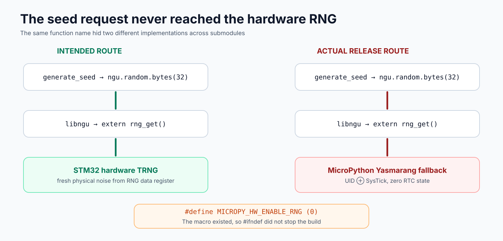
</picture>

The fallback used Yasmarang, a small non-cryptographic PRNG. On a cold-start Mk3, its first state reduces to:

```text
pad = UID[0] XOR SysTick
n = 0
d = 0
dat = 0
```

The RTC values are zero on this path. A second Yasmarang stream starts from public constants and is not reseeded on Mk3. It changes the output bytes but adds no entropy.

The weak seed path first shipped in public firmware 4.0.0 on March 17, 2021. Coinkite's published user advisory starts with 4.0.1 on March 29, 2021, and ends with 4.1.9.<sup>[[2]]</sup> Firmware 4.1.9 was the last public Mk2/Mk3 release before the 2026 fix. Coinkite's technical report confirms the route.<sup>[[3]]</sup> Seeds made during those five years could remain unused and invisible on-chain until one of their derived addresses received funds.

## Tracing the weak RNG path

My firmware analysis was a source-code trace. I followed the seed request through Coldcard firmware, `libngu`, and the pinned MicroPython code to determine which `rng_get()` implementation the build selected.

<picture>
  <source media="(prefers-color-scheme: dark)" srcset="../images/posts/coldcard-proof-chain-dark.svg">
  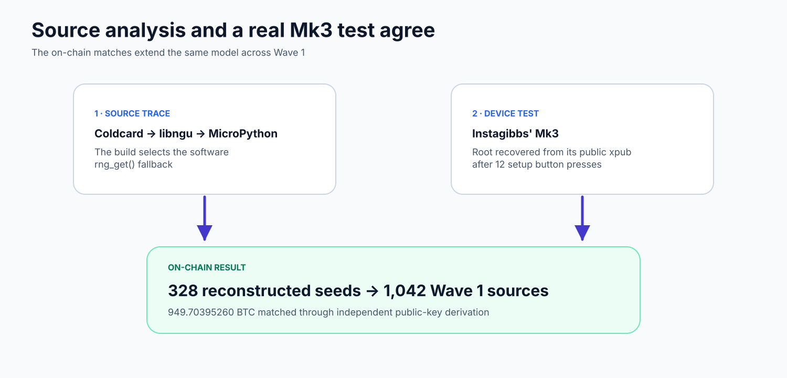
</picture>

### Source and build configuration

The source trace follows the normal seed request through firmware, `libngu`, and the pinned MicroPython submodule. It shows both `rng_get()` implementations and the board setting that selects the software one. [Block Engineering's independent review][4] reached the same root cause.

### Public device confirmation

[Instagibbs confirmed the weakness on a real Mk3][5]. He initialized the device from a cold start and accounted for the number of button presses during setup.

## What the recovered findings say about UID state

This theory started with the firmware code path, before I had the recovered wallet data. The fallback reads the first 32-bit STM32 UID word and XORs it with SysTick. STM32 defines that UID word as wafer X and Y position fields, so I modeled it as structured factory data instead of a random 32-bit secret. SysTick is also bounded. The two values enter one XOR word, so their candidate counts cannot be multiplied as if they were independent fields concatenated together.

That XOR result is the pad. Its high word is:

```text
pad_high = floor(pad / 65,536)
```

The low word is the UID X field XOR SysTick. It does not reveal the physical X coordinate. SysTick has a seventeenth bit in the tested timing range, so it can also flip the low bit of the high word. For that reason, `pad_high` is not an exact physical Y coordinate. It is still a useful measurement of the recovered state space.

The combined analysis covers 1,013 unique, previously funded wallets. Of those, 328 match Wave 1 and 685 do not. Across these findings, every observed pad high word lies between 15 and 75. The Wave 1 maximum is 74. The outside-Wave group reaches 75.

The public 853-finding campaign summary gives the clearest distribution:

| Pad high-word band | Funded findings |
| ------------------ | --------------: |
| 15–29              |             152 |
| 30–44              |             250 |
| 45–59              |             172 |
| 60–69              |             232 |
| 70–75              |              47 |
| **Total**          |         **853** |

Only three of those 853 findings have a high word of 75.

<picture>
  <source media="(prefers-color-scheme: dark)" srcset="../images/posts/coldcard-uid-pad-range-dark.svg">
  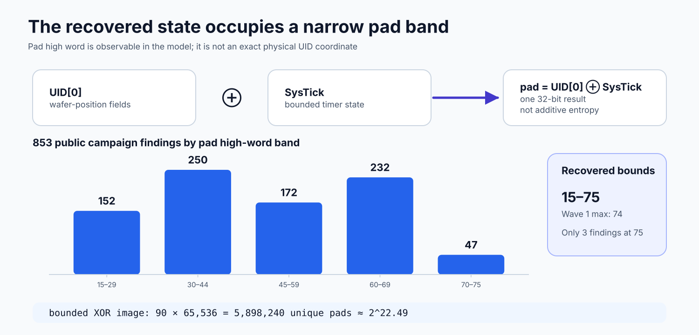
</picture>

I chose 90 as a working upper bound when I built the first search. I did not yet have enough recovered wallets to know that the observed pad high words would stop at 75. The 90 in the calculation describes that original search range, while 15–75 describes what the later matches showed.

The XOR overlap changes the size of the bounded model. Suppose the raw UID word is represented as `(y << 16) | x`, both coordinate fields are in `[0, 90)`, and SysTick covers `[0, 80,000)`. SysTick covers all possible low 16-bit values, so changing `x` only permutes pads already in the set. Its next bit exchanges paired `y` values. The unique image is therefore:

```text
90 × 65,536 = 5,898,240 unique pads ≈ 2^22.49
```

The naive product `90 × 90 × 80,000` counts input tuples, including many that collapse to the same pad.

The 1,013 verified matches support the narrow high-word range. They do not turn the pad high word into a direct UID measurement.

I also tested above the recovered range. A complete high-word 90–99 campaign found no proof. A later high-word 100–255 campaign found no funded result across its exact zero-RTC, no-added-dice, account-zero receive-path scope. A separate researcher reported a wider raw 32-bit pad search with no match to the final 153, but did not provide enough trace and path artifacts for me to count it as closed coverage.

These results make a simple larger-UID-range explanation less likely.

## Other uses of the weak random stream

The same `ngu.random` stream that produced weak seeds also supplied values to other firmware features. The effect depends on how each feature uses its random input, and the defect did not make every signature recoverable.

| Use                                  | Effect of the weak stream                                                                                                                                                                              |
| ------------------------------------ | ------------------------------------------------------------------------------------------------------------------------------------------------------------------------------------------------------ |
| Normal Mk3 seed generation           | The root secret becomes enumerable under the reconstructed state model                                                                                                                                 |
| Standard Bitcoin ECDSA signing       | No RNG-based nonce reuse: libsecp256k1 uses deterministic RFC 6979 nonces                                                                                                                              |
| Edge BIP340 Schnorr auxiliary data   | Predictable auxiliary data weakens protection against side-channel and fault attacks; it does not cause nonce reuse by itself                                                                          |
| Edge 6.5.0 MuSig2 session data       | The weak value violates the MuSig2 requirement for unique, secret, uniform session randomness; repeated effective nonces can expose a participant key, but there is no public proof that this happened |
| libsecp256k1 context blinding        | Predictability weakens physical side-channel and fault defenses; it does not change the ECDSA signature nonce                                                                                          |
| Backup passwords, 7z salt, and 7z IV | These use the separate STM32 hardware RNG path                                                                                                                                                         |

Importantly, the encrypted microSD backup path did not use the weak stream for its security. Coldcard used its random APIs inconsistently. Normal wallet generation had moved to `ngu.random.bytes`, while [backup password generation](https://github.com/Coldcard/firmware/blob/bcc2c382a324690a2fcf972c0bac3b79bf923f7b/shared/backups.py#L326-L345) still called `ckcc.rng_bytes`, the older STM32 hardware RNG interface. The [7z salt and IV](https://github.com/Coldcard/firmware/blob/bcc2c382a324690a2fcf972c0bac3b79bf923f7b/shared/compat7z.py) used that hardware path too. The weak `ngu.random` stream selected only the filename inside the archive. A backup of a weak seed still contains that weak seed, but this defect did not also make the backup password, salt, or IV predictable.

A securely generated seed imported into affected firmware does not become enumerable through normal ECDSA signatures. Seeds created entirely through the documented dice-only process also bypass the affected on-device seed route. These limits matter because an overbroad warning can send users toward unnecessary and risky recovery steps.

Device generation also matters. Mk3 had no secure-element reseed on this path. Mk4, Q, and Mk5 mixed secure-element input into the software state, which mitigated the remote seed-recovery attack. That reseed contributed 32 true bits to one state word, so it was narrower than a full cryptographic reseed and was one part of the 2026 repair described by Block Engineering.<sup>[[4]]</sup>

I plan to publish a separate technical write-up of the Mk4-and-later RNG path soon.

The first fixed releases listed by Coinkite are 4.2.0 for Mk2/Mk3, 5.6.0 for standard Mk4/Mk5, 1.5.0Q for standard Q, 6.6.0X for Mk4/Mk5 Edge, and 6.6.0QX for Q Edge.<sup>[[2]]</sup> A fixed release changes future random output. It cannot replace secrets or protocol data made by affected firmware.

## Galaxy's Wave 1 baseline

Galaxy published the 1,082.65 BTC total soon after the sweep. That report was the public starting point for this investigation.

Galaxy published four destination addresses. Two were funded by consolidation transactions that combined earlier victim sweeps. I followed each consolidation input back to its source transaction. The other two addresses belong to the Original 500 branch: its first collector and the address that later received 341 of its outputs. Galaxy's fourth address held the 32.45 BTC left at that first collector.

The Original 500 address received 500 victim sweeps, then moved 341 of those outputs to another address in block 960191. The lowest-value 159 outputs stayed behind. Holding 2 and Holding 3 took the other two collector routes. The [first-seen analysis](#first-seen-times-show-how-the-sweep-ran) below shows the order in which these routes ran.

The branches also divide into separate scan-session ranges, while every victim sweep has the same transaction template. This looks like separate jobs from one search and sweep system.

That process produced 1,195 source transactions that I can trace and verify. All figures below use that set.

## Reconstructing the three branches

<picture>
  <source media="(prefers-color-scheme: dark)" srcset="../images/posts/coldcard-wave1-branches-dark.svg">
  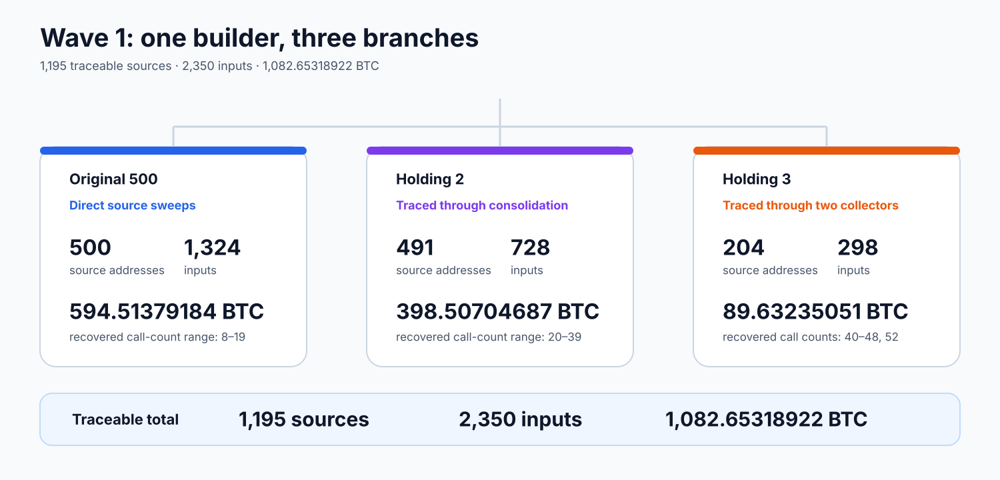
</picture>

| Branch               | Source addresses |    Inputs |          Input BTC |
| -------------------- | ---------------: | --------: | -----------------: |
| Original 500         |              500 |     1,324 |       594.51379184 |
| Holding 2            |              491 |       728 |       398.50704687 |
| Holding 3            |              204 |       298 |        89.63235051 |
| **Traceable Wave 1** |        **1,195** | **2,350** | **1,082.65318922** |

The Original 500 branch is the largest of the three. All three branches share the same uncommon construction rules and split cleanly by activity before seed generation. During normal setup, keypad scanning consumed values from the weak software generator before the firmware requested the seed itself. Each use advanced the generator, so a different scan-session count produced a different seed. The recovered counts are 8–19 for Original 500, 20–39 for Holding 2, and 40–48 plus one result at 52 for Holding 3.

That split suggests one candidate stream processed in batches.

## One transaction builder across the wave

All 1,195 traceable source transactions have the same basic form:

- transaction version 2;
- locktime 0;
- final input sequence `0xffffffff`, so no opt-in RBF;
- one destination output;
- one source address per transaction;
- a fee equal to 30 times the same static size estimate;
- no low-R signature grinding.

The input order is more distinctive. There are 145 transactions with more than one input. All 145 spend the source address's UTXOs from newest funding transaction to oldest. This is not BIP69 ordering, wallet coin selection, or the natural order produced by most general wallet software. It looks like an address API returned transaction references in reverse blockchain order and the sweep builder kept that order.

The exact count of 500 in the largest branch provides another clue. The source totals entered blocks in descending value groups, and the smallest was close to 0.15 BTC. The pattern is consistent with a work queue ranked by aggregate address balance and capped at 500 records, not the complete candidate list. The chain does not reveal the database query or service that produced the queue.

The same builder across three destination branches is strong evidence that the branches belong to one operation.

## First-seen times show how the sweep ran

After I shared a draft of this article, [orangesurf](https://x.com/orangesurf) pointed me to mempool.space's first-seen records. They add the order in which mempool.space saw the transactions, not just the blocks in which they confirmed. That order shows how the attacker ran the sweep.

<picture>
  <source media="(prefers-color-scheme: dark)" srcset="../images/posts/coldcard-first-seen-queues-dark.svg">
  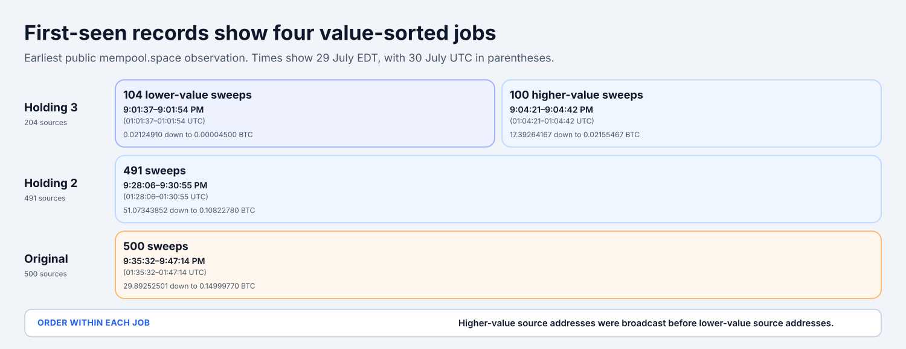
</picture>

The attacker broadcast four separate jobs, and each job ran from higher-value source addresses to lower-value ones. Holding 3 was split again: 104 lower-value sources went to one collector, then 100 higher-value sources went to another 147 seconds later. This explains the extra Holding 3 collector. Its sources were divided by value before they were broadcast.

Holding 2 and Holding 3 finished and confirmed before their consolidation transactions appeared. The larger Original job was still running. Its consolidation spent the first 341 outputs that had already confirmed. The final 159 confirmed in the same block as the consolidation and stayed at the collector. The attacker appears to have broadcast value-sorted address queues, then consolidated the outputs that were already confirmed.

I recovered a first-seen observation for every Wave 1 sweep from mempool.space's seven public IPv4 backends. The exact seconds differ between nodes, but the four jobs and their value order are consistent across them.

## From reconstructed seeds to stolen addresses

The search follows the same broad method used by the [Milk Sad project][7] and [Coinspect's Ill Bloom research][8]: generate candidates from the faulty process, check a narrow address set for historical use, and then expand each confirmed seed across more derivation paths. The first Wave 1 source set did not match either project's public dataset.

For candidate matching, I used the historical snapshot at block 960182, immediately before Wave 1 began at block 960183.

Once the source-based event model began producing matches, I applied the same pre-seed traces to that historical funded-address index and to the fixed Wave 1 source set. A candidate counted only when it derived the matching public address.

The table shows how much of each Wave 1 branch can be traced to reconstructed wallet seeds. “Explained source addresses” counts stolen source addresses derived from those seeds. “Explained BTC” is the bitcoin swept from those addresses. The final column is that amount as a share of all bitcoin stolen through the branch.

| Branch       | Reconstructed wallet seeds | Explained source addresses |    Explained BTC | Branch BTC explained |
| ------------ | -------------------------: | -------------------------: | ---------------: | -------------------: |
| Original 500 |                        198 |                  476 / 500 |     565.42100039 |               95.11% |
| Holding 2    |                         91 |                  415 / 491 |     361.78426942 |               90.78% |
| Holding 3    |                         39 |                  151 / 204 |      22.49868279 |               25.10% |
| **Wave 1**   |                    **328** |          **1,042 / 1,195** | **949.70395260** |           **87.72%** |

<picture>
  <source media="(prefers-color-scheme: dark)" srcset="../images/posts/coldcard-wave1-coverage-dark.svg">
  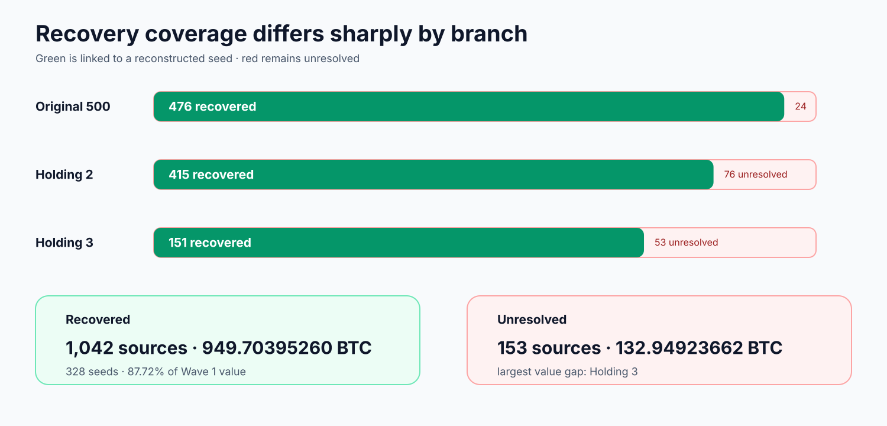
</picture>

The 1,042 matched source transactions map to 328 seeds. The median is two transactions per seed, and the maximum is 58. Half of the recovered seeds map to two or more source transactions.

Two early reconstructed seeds provided a compact proof of seed-level compromise. Four stolen addresses derived from those two seeds, and three of the addresses derived from one seed. Their inputs totaled 34.95091712 BTC. The incident was not a collection of unrelated single-key leaks.

The pre-drain snapshot matched 685 previously funded Coldcard wallets that do not appear in reconstructed Wave 1. Some appear in later numbered waves. Others have funded addresses outside the numbered campaign catalog. These historical matches show that the model applies beyond Wave 1 even though it does not reduce the final Wave 1 gap.

## What the reconstructed RNG paths suggest

I wanted the reconstructed seeds to reveal the attacker's search, not only confirm which wallets were vulnerable. I wanted to know which RNG call histories the attacker tested, whether users had added dice rolls to the weak RNG path, where the search stopped, and whether the three destination branches represented separate parts of that search.

The 153 unresolved sources prevent a complete answer. A reconstructed seed also does not reveal the exact setup actions on the wallet that produced it. Different sequences of keypad and setup events can advance the software generator to the same effective state before seed generation. I tested nine other plausible event sequences and recovered two seeds that the main model had already found. Those seeds covered six Wave 1 source addresses. The coordinates below describe the attacker's likely search model.

This section depends on the search-shape assumption above. If the final 153 used a different seed-generation path, parts of this interpretation will change.

<picture>
  <source media="(prefers-color-scheme: dark)" srcset="../images/posts/coldcard-rng-search-shape-dark.svg">
  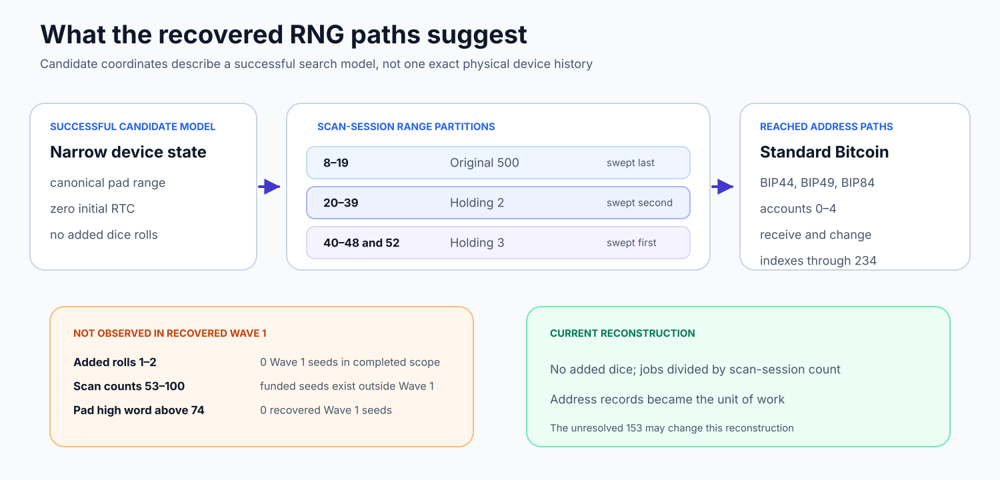
</picture>

### No added dice in the recovered Wave 1 set

Here, “added dice” means that the user mixed a small number of rolls into the normal device-generated seed path. It is not the separate dice-only process, where enough rolls provide the seed entropy without using the weak device RNG path.

Every Wave 1 seed recovered through the candidate campaigns uses the model with no added dice. A complete native-SegWit campaign tested one and two added rolls for scan-session counts 8 through 50 and found no Wave 1 seed. A separate legacy and wrapped-SegWit campaign tested most of the one-through-three-added-roll range for counts 6 through 45. It checked 60,595,816,960 candidates and found two affected, previously funded seeds with 29 addresses, but none was in Wave 1.

The added-roll campaigns found affected wallets, but no Wave 1 match in the tested ranges. Under the search-shape assumption, the attacker probably left added-dice branches out of Wave 1. Each added roll multiplies that part of the search by six, so excluding them reduces the work sharply. Added-dice paths among the unresolved 153 and combinations outside the tested ranges remain open.

### The destination branches follow scan-count ranges

The reconstructed scan-session counts split cleanly by destination branch:

| Wave 1 branch | Reconstructed scan-session counts |
| ------------- | --------------------------------: |
| Original 500  |                              8–19 |
| Holding 2     |                             20–39 |
| Holding 3     |                      40–48 and 52 |

The recovered range is continuous from 8 through 48, followed by one result at 52. There is no recovered Wave 1 seed at 49, 50, or 51, and none from 53 through 100. Broader searches with no added dice still found affected, previously funded wallets at higher counts outside Wave 1.

The confirmation order runs in the opposite direction. Holding 3, with the highest reconstructed counts, came first. Holding 2 followed, then the Original branch with the lowest counts. The [first-seen data](#first-seen-times-show-how-the-sweep-ran) goes further: each collector received a separate value-sorted queue. This does not look like an ascending brute-force loop that swept each candidate as soon as it was found. The attacker prepared the lists before broadcast or processed them as independent jobs.

The recovered split appears consistent with one candidate stream divided into contiguous scan-count jobs, each sent to a separate destination branch. The recovered Wave 1 set ends near count 52. Rejected candidates leave no chain record, so the attacker's search may have continued beyond that point.

### Broad, conventional Bitcoin paths

The 1,042 reconstructed sources contain 1,033 native-SegWit addresses, six legacy addresses, and three wrapped-SegWit addresses. They include accounts zero through four, receive and change branches, and indexes as high as 234. This was not a scan of only the first address of each wallet.

The results were still handled as separate address records. The 1,042 source transactions map to 328 seeds, with as many as 58 swept addresses from one seed. That behavior fits a process that derived standard paths, ranked funded addresses, and saved address-and-key records without preserving the wallet as the unit of work.

### The paths Wave 1 left behind

A seed is the root of all its child keys, but Wave 1 did not empty every wallet whose seed it had reached. Later waves swept other addresses or UTXOs from 99 reconstructed Wave 1 seeds in Wave 2 and 31 in Wave 3. These later addresses do not require a different RNG explanation. Once a searcher reconstructs the same weak root seed, the additional keys follow deterministically.

I measured the value at the exact addresses found from those 328 seeds using the UTXO set at block 960182, immediately before Wave 1. The 3,263 known addresses held **1,024.95952976 BTC**. Wave 1 swept **949.70395260 BTC** and left at least **75.25557716 BTC**. Of that remainder, 0.18606869 BTC stayed on source addresses that Wave 1 attacked, while 75.06950847 BTC sat on other known addresses from the same seeds. This is a minimum because I counted only addresses the searches have found.

This makes the omissions part of the attacker analysis. A wallet-aware Bitcoin sweep would derive the standard script families, follow receive and change branches, observe the gap limit, and collect every spendable UTXO before it discarded the seed. Wave 1 instead flattened wallets into address jobs. The 500-address cap, incomplete derivation coverage, separate sweeps for sibling addresses, and unprocessed second UTXO page all left value behind despite the underlying seed compromise.

The pattern is consistent with an operator who could reproduce the vulnerable seeds but did not inspect every derived Bitcoin path, or did not build that part of the tool well.

The later transaction builders also differ from Wave 1. All 145 multi-input Wave 1 transactions kept newest-funded UTXOs first. In Wave 2, only two of 11 comparable same-address groups did so. Wave 2 also used RBF, different fee bands, and different input grouping. This makes another operator or another tool plausible. Later sweeps reached addresses or UTXOs that Wave 1 missed, and they did not use the exact Wave 1 transaction builder.

### Limits in the recovered coordinates

The recovered candidates fit the simple zero-RTC keypad model with no added dice. Their pad high words stop at 74, while affected funded seeds outside Wave 1 reach 75. The Wave 1 and outside groups have nearly identical pad means and medians. Wider tests above the observed pad range found no new funded seed in their stated scopes. This makes the narrow device-state model a good explanation for the recovered set, but it gives no evidence that Wave 1 targeted a special UID or pad band.

The recovered coordinates do not reveal the attacker's exact pad order or the UID bounds in the attacker's program. One pad combines UID and SysTick, so neither input can be recovered from the pad alone. Empty candidates leave no chain evidence. The 500-address cap and the 200-UTXO cutoff occurred later, during address and UTXO processing, not during RNG enumeration.

Under the search-shape assumption, my best reconstruction is a bounded search with no added dice, partitioned by scan-session count, followed by standard Bitcoin derivation and address-level balance selection. The unresolved 153 may still change that reconstruction.

## The attacker's address pipeline

Wave 1 looks like an address-record operation, not a wallet-aware sweep.

<picture>
  <source media="(prefers-color-scheme: dark)" srcset="../images/posts/coldcard-attacker-pipeline-dark.svg">
  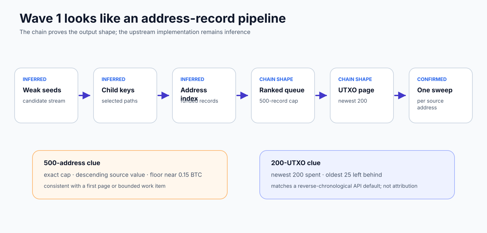
</picture>

A likely pipeline is:

1. Generate weak seed candidates.
2. Derive selected child keys and Bitcoin addresses.
3. Join those addresses to an indexed balance or activity dataset.
4. Keep address and private-key records that meet the operator's selection rule.
5. Fetch UTXOs for one address.
6. Build and sign one sweep transaction for that address.

One source address provides a stronger API clue. It had 225 live UTXOs. The sweep spent the newest 200 and left the oldest 25, including one worth 0.16083170 BTC. [BlockCypher's address endpoint][6] defaults to 200 transaction references and returns them in descending blockchain order. That behavior matches both the cutoff and the Wave 1 input order.

<picture>
  <source media="(prefers-color-scheme: dark)" srcset="../images/posts/coldcard-utxo-page-cutoff-dark.svg">
  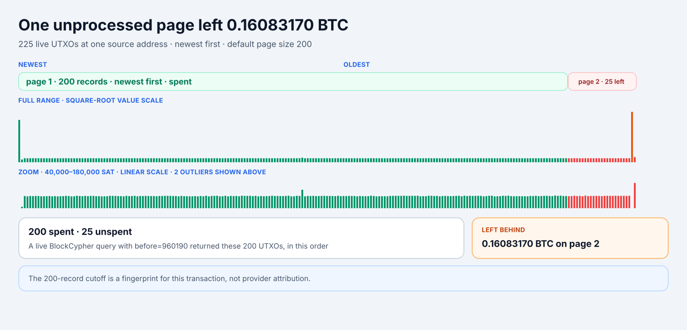
</picture>

This is a fingerprint, not provider attribution. Other software can copy the same defaults, and a custom index can return the same shape. The spend is consistent with a failure to process a second page from a reverse-chronological 200-record result.

The 500-address cap has the same limit. It looks like a ranked work item or first page. The chain cannot tell whether that boundary came from SQL, an API, a spreadsheet, or an explicit command-line option.

## Why I suspect a paid API and an Ethereum-style workflow

I think the attacker used a paid blockchain-data API to discover balances and UTXOs, then signed the transactions with separate code. [BlockCypher][6] is the closest technical match I have found. Its Bitcoin address endpoint returns newest records first, defaults to 200 records, and tells the caller when another page exists. For the address with 225 UTXOs, I reproduced the exact 200 selected UTXOs, in the same order, with the live BlockCypher endpoint. This makes BlockCypher my leading hypothesis for the UTXO-discovery step.

### BlockCypher's pricing could leave an account trail

[BlockCypher's published plans](https://www.blockcypher.com/pricing.html) list 100 requests per hour for Free and 500 for the $150-per-month Prototype plan. Querying even the 1,195 known Wave 1 source addresses during the 41-minute sweep window would exceed either limit. The attacker would have needed multiple accounts, an Enterprise plan, or data collected before the sweep. Searching candidate-derived addresses through the API would require far more requests.

Enterprise lists 15,000 or more requests per hour and directs customers to contact BlockCypher. If BlockCypher was the provider, account creation, billing, token, or Enterprise contact records may show the request count and timing. BlockCypher would need to check those records. Another provider or a cache built before the sweep could produce the same chain pattern.

Block security engineer Clay Garrett later [reported that an unnamed blockchain-services provider][9] found a paid account whose request count, timing, and sequence matched the suspected attack. The provider has not been named publicly. Garrett also said there was no evidence that the provider knowingly took part in or helped with the suspected theft. His report supports the general paid-API theory but does not name the provider.

<picture>
  <source media="(prefers-color-scheme: dark)" srcset="../images/posts/coldcard-seed-address-units-dark.svg">
  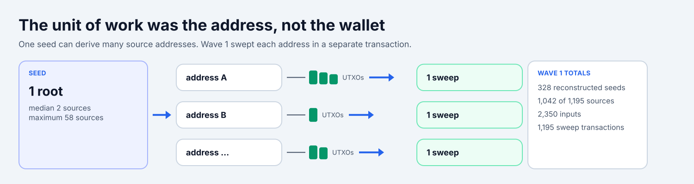
</picture>

I also suspect that whoever wrote the sweep code was more familiar with an account-based chain, such as Ethereum, than with Bitcoin wallet software. On Ethereum, ranking accounts by balance and sending one transfer per account is natural. The cost of a basic transfer does not depend on how many earlier deposits funded the account. Bitcoin value lives in separate UTXOs, so input selection affects the fee.

The transaction pattern is consistent with an account-balance mental model and weak Bitcoin wallet handling. The sweep kept addresses from the same seed as separate jobs, spent a 294-satoshi input that added about 2,040 satoshis to the fee, and left a 0.16083170 BTC UTXO behind an unprocessed page.

A weak-seed scanner naturally produces address records, and an address-based API encourages the same design.

## The last 153 addresses

The unresolved set is unevenly distributed:

| Branch       | Missing sources |      Missing BTC |
| ------------ | --------------: | ---------------: |
| Original 500 |              24 |      29.09279145 |
| Holding 2    |              76 |      36.72277745 |
| Holding 3    |              53 |      67.13366772 |
| **Wave 1**   |         **153** | **132.94923662** |

<picture>
  <source media="(prefers-color-scheme: dark)" srcset="../images/posts/coldcard-missing153-clue-dark.svg">
  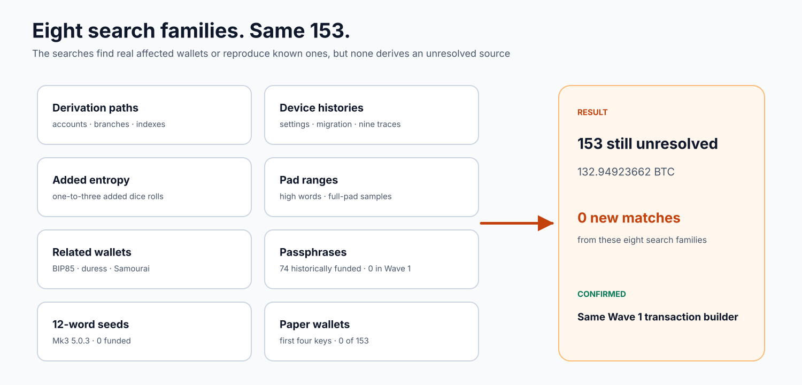
</picture>

[Download the 153 unresolved Wave 1 source addresses][10] as a CSV file. The file contains only public blockchain data: address, script type, Wave 1 branch, sweep block height, input count, and swept value. Every address in the file was swept during Wave 1. Here, “unresolved” means that no researcher has yet reproduced the affected seed behind the address. Do not send funds to these addresses.

SHA-256: `59ac0e4e71f6a5502aa4a6ea8191d1848f2986cc90878229933e1bcc496e870a`

All 153 transactions use the same builder as the recovered set. The difference therefore appears upstream of transaction construction: candidate generation, device state, derivation coverage, or the data used to select targets.

The search history makes the gap more interesting than a normal incomplete scan.

- Expanding BIP49 receive coverage past index 25 recovered a new Wave 1 seed at index 40.
- Searching nonzero BIP84 accounts recovered two more Wave 1 seeds.
- Checking more address indexes on both the receive and change branches recovered additional Wave 1 sources.
- Nine alternative Coldcard event traces found new funded seeds outside Wave 1 and reproduced already-known Wave 1 sources, but found no new source in the 153.
- Searches above the observed pad range, plus partial and evenly spaced tests across the full 32-bit pad range, found no new member of the 153.
- An independently reported full raw-pad search also found none, although its full artifacts are not public.

These searches find hundreds of funded seeds outside Wave 1. They can also reproduce the recovered part of Wave 1. Their repeated failure on the same 153 suggests that the attacker used something that public reconstruction attempts do not yet represent. Several researchers I have spoken with have reconstructed other affected seeds, including seeds outside Wave 1, but none of them has reproduced a seed for any of these 153 source addresses. If you have reproduced one, please contact me. I have spent the past week trying to explain this gap, and it still has me stumped.

The possibility I take most seriously is that public reconstruction attempts are missing an input or a method. Anyone with access to the relevant STM32 chips could collect UID measurements, and anyone with affected devices could collect device-state measurements. The attacker may instead have generated candidates in a way that current research has not considered. Most public reconstruction work has come from Bitcoin researchers, so an embedded-systems, semiconductor, or other perspective may expose an assumption we have missed.

If that is correct, the missing 153 could help explain the attacker's method. Their shared properties could reveal how the attacker selected candidates, and a repeated boundary could identify software behavior.

## What is confirmed, inferred, and still open

| Confirmed                                                                             | Inferred from evidence                                               | Open                                     |
| ------------------------------------------------------------------------------------- | -------------------------------------------------------------------- | ---------------------------------------- |
| The affected seed path linked to software Yasmarang instead of the STM32 hardware RNG | The 500-source branch came from a capped, value-ranked address queue | The operator's full derivation range     |
| The selected software `rng_get()` reads UID, SysTick, and RTC state                   | The 200-of-225 spend reflects one unprocessed API page               | Which API or indexer the attacker used   |
| Instagibbs confirmed the weakness on a real cold-start Mk3                            | One shared tool probably built all three Wave 1 branches             | Why later waves used different builders  |
| 328 seeds map to 1,042 Wave 1 sources                                                 | The 153 preserve attacker-specific inputs or knowledge               | The seed model behind the 153            |
| Recovered pad high words lie between 15 and 75                                        | A simple larger-pad explanation is unlikely                          | The attacker's identity and data sources |

## How I got involved

I was in the right place at the right time. At 1:35 PM EDT (17:35 UTC) on July 30, I was browsing X when [Kevin Loaec asked Coldcard owners to check their balances][13]. I had used Coldcard myself and recommended it to other people. I started investigating because I wanted to rule out a Coldcard RNG problem.

By about 5:10 PM EDT (21:10 UTC), I had found the broken seed-generation path in the firmware source. Before posting about it, I contacted Coinkite at 5:18 PM EDT (21:18 UTC) and told them what I thought I had found. At 5:46 PM EDT (21:46 UTC), [I warned Mk2 and Mk3 users to move their funds][14]. [James O'Beirne posted his warning][15] 37 seconds later, and [Instagibbs confirmed the weakness on a real Mk3][5] at 6:37 PM EDT (22:37 UTC).

<picture>
  <source media="(prefers-color-scheme: dark)" srcset="../images/posts/coldcard-july30-timeline-dark.svg">
  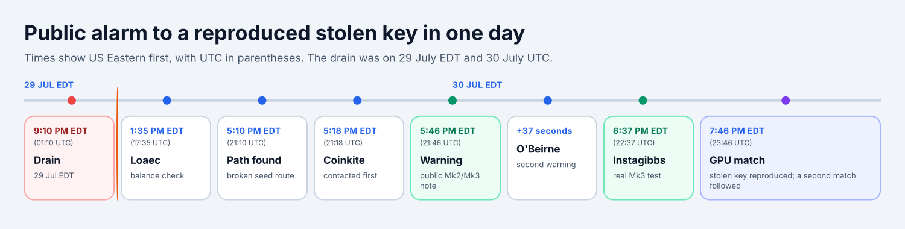
</picture>

At 7:46 PM EDT (23:46 UTC), I ran the weak RNG model on GPUs and compared the generated keys with addresses from the theft. [The search reproduced a private key for one of the stolen addresses][16], and a second match followed. This was the first public empirical link between the firmware defect and the theft itself. The Wave 1 work in this article grew from that first investigation.

## Edit history

**August 13, 2026:** I revised a sentence about possible non-public attacker inputs because readers interpreted it as identifying a specific source. I meant data that anyone with access to the relevant STM32 chips or affected devices could collect independently. I also meant to leave open the possibility that the attacker used a method that current Bitcoin-focused research has not considered. I was not identifying who collected the data.

[1]: https://x.com/glxyresearch/status/2083181683067506899
[2]: https://coldcard.com/docs/upgrade/#important-security-advisory
[3]: https://blog.coinkite.com/entropy-technical-backgrounder/
[4]: https://engineering.block.xyz/blog/predictable-rng-fallback-and-32-bit-reseed-in-coldcard-firmware
[5]: https://x.com/theinstagibbs/status/2082958675975553224
[6]: https://www.blockcypher.com/dev/bitcoin/#address-endpoint
[7]: https://milksad.info/
[8]: https://illbloom.org/articles/ill-bloom-address-set-1-methodology/
[9]: https://x.com/clay_garrett/status/2083247006139503065
[10]: /data/posts/coldcard-wave1-unresolved-153.csv
[11]: https://covebitcoin.com/
[12]: https://x.com/PraveenPerera
[13]: https://x.com/KLoaec/status/2082882772092211589
[14]: https://x.com/PraveenPerera/status/2082945886309540311
[15]: https://x.com/jamesob/status/2082946043696574756
[16]: https://x.com/PraveenPerera/status/2082976249371115811
[17]: https://opensats.org/projects/cove
